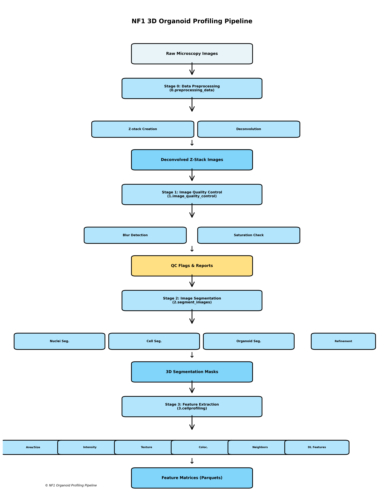

========================================================================
Pipeline Workflow
========================================================================

Overview
==================================================

The NF1 3D Organoid Profiling Pipeline is designed to process raw 3D microscopy imaging data through multiple stages of analysis. Below is a comprehensive overview of the complete workflow.

Workflow Stages
==============================================================

Stage 0: Data Preprocessing
--------------------------------------------------------------

**Directory:** ``0.preprocessing_data/``

This stage handles raw data ingest and preparation:

1. **Patient-specific preprocessing** - Organize raw image files
2. **File structure updates** - Create standardized directory hierarchy
3. **Z-stack creation** - Combine 2D slices into 3D stacks
4. **Corruption checks** - Validate file integrity
5. **Deconvolution preprocessing** - Prepare images for deconvolution
6. **Post-deconvolution processing** - Clean up after Huygens deconvolution

**Inputs:** Raw microscopy images

**Outputs:** Deconvolved z-stack images (`.tif` files)

**Key Files:**
- ``0.patient_specific_preprocessing.py``
- ``1.update_file_structure.py``
- ``2a.make_z-stack_images.py``
- ``3.decon_preprocessing.py``
- ``4.post_decon_preprocessing.py``

Stage 1: Image Quality Control
-----------------------------------------------------------------

**Directory:** ``1.image_quality_control/``

Evaluate image quality metrics and identify problematic images:

1. **Run CellProfiler QC pipeline** - Extract QC metrics
2. **Evaluate blur metrics** - Identify out-of-focus images
3. **Evaluate saturation metrics** - Detect overexposed regions
4. **Generate QC reports** - Visualize results with ggplot

**Inputs:** Deconvolved z-stack images

**Outputs:** QC flags, QC reports, flagged well FOVs

**Quality Metrics:**
- Blur detection
- Saturation levels
- Signal-to-noise ratios
- Illumination uniformity

Stage 2: Image Segmentation
--------------------------------------------------------------

**Directory:** ``2.segment_images/``

Perform 3D segmentation of organoids and cellular compartments:

1. **Nuclei segmentation** - Using deep learning (Cellpose/SAM-Med3D)
2. **Organoid segmentation** - Whole organoid boundary detection
3. **Cell segmentation** - Individual cell masks
4. **Compartment segmentation** - Organelle-specific masks
5. **Mask refinement** - Post-hoc improvements

**Inputs:** QC-passed z-stack images

**Outputs:** 3D segmentation masks (`.tif` files)

**Segmentation Types:**
- Nuclei (DNA channel, 405 nm)
- Cells (Phalloidin channel, 568 nm)
- Organoids (composite segmentation)
- Cytoplasm (derived from cell and nuclei masks)

Stage 3: Feature Extraction (CellProfiler)
-------------------------------------------

**Directory:** ``3.cellprofiling/``

Extract morphological and intensity features from segmented objects:

1. **Area/Size/Shape features** - Volume, surface area, centroids
2. **Intensity features** - Mean, median, max intensities per channel
3. **Texture features** - Haralick features, local binary patterns
4. **Colocalization features** - Channel co-occurrence metrics
5. **Neighbor features** - Cell-to-cell adjacency and distances
6. **Granularity features** - Multi-scale texture analysis
7. **Deep learning features** - SAMMed3D embeddings (optional)

**Inputs:** Segmentation masks + original images

**Outputs:** Feature matrices (`.csv`/`.sqlite` files)

**Processing Options:**
- CPU-based: All features on CPU
- GPU-accelerated: Intensity and colocalization on GPU (if available)

Stage 4: Profile Processing
---------------------------------------------------------------

**Directory:** ``4.processing_image_based_profiles/``

Aggregate and normalize features across wells and patients:

1. **Merge profiles** - Combine features from all well FOVs
2. **Normalize features** - Z-score normalization per plate
3. **Filter outliers** - Remove invalid measurements
4. **Aggregate profiles** - Calculate per-well and per-patient statistics
5. **QC filtering** - Apply image QC flags to remove bad data

**Inputs:** Feature matrices from CellProfiler

**Outputs:** Aggregated profile matrices (`.parquet` files)

**Output Formats:**
- Single-cell profiles
- Organoid-level profiles
- Well-aggregated profiles
- Patient-aggregated profiles

Stage 5: Exploratory Data Analysis
----------------------------------------------------------------------

**Directory:** ``5.EDA/``

Perform comprehensive analysis and visualization:

1. **Feature correlation analysis** - Identify relationships
2. **Dimensionality reduction** - UMAP/t-SNE visualization
3. **Mean average precision (mAP)** - Feature reproducibility metrics
4. **Hit detection** - Identify significant treatment effects
5. **Statistical analysis** - Hypothesis testing
6. **Figure generation** - Publication-ready visualizations

**Inputs:** Aggregated profiles

**Outputs:** Analysis results, figures, statistical reports

Stage 6: Interactive Visualization
----------------------------------------------------------------------

**Directory:** ``6.dynamic_viz_Rshiny/``

Deploy interactive Shiny application for result exploration:

1. **Profile browser** - Explore single-cell/organoid-level data
2. **Feature scatter plots** - Interactive 2D/3D visualization
3. **Treatment comparison** - Side-by-side analysis
4. **Heatmap generation** - Feature correlation visualization

**Inputs:** Aggregated profiles

**Outputs:** Interactive web application

Data Organization
=========================================================

The pipeline expects data to be organized as follows::

    data/
    ├── patient_IDs.txt
    ├── NF0014_T1/
    │   ├── zstack_images/
    │   │   ├── C4-2/
    │   │   │   ├── 405.tif
    │   │   │   ├── 488.tif
    │   │   │   ├── 555.tif
    │   │   │   ├── 568.tif
    │   │   │   └── 640.tif
    │   │   └── ...
    │   ├── segmentation_masks/
    │   │   ├── C4-2/
    │   │   │   ├── nuclei_*.tif
    │   │   │   ├── cell_*.tif
    │   │   │   └── ...
    │   │   └── ...
    │   └── extracted_features/
    │       ├── C4-2/
    │       │   ├── AreaSizeShape_*.csv
    │       │   ├── Intensity_*.csv
    │       │   └── ...
    │       └── ...
    ├── NF0016_T1/
    └── all_patient_profiles/
        ├── sc_profiles.parquet
        ├── organoid_profiles.parquet
        └── patient_profiles.parquet

Channel Information
===========================================================

The pipeline processes five imaging channels:

.. table:: Imaging Channels
   :align: center

   +-------------------+------------------------+--------+-----------+
   | Channel Name      | Fluorophore            | λ ex   | Organelle |
   +===================+========================+========+===========+
   | Hoechst (405 nm)  | Hoechst 33342          | 361 nm | Nucleus   |
   +-------------------+------------------------+--------+-----------+
   | AGP (488 nm)      | ConA Alexa Fluor 488   | 495 nm | ER        |
   +-------------------+------------------------+--------+-----------+
   | ER (555 nm)       | WGA Alexa Fluor 555    | 555 nm | Golgi/PM  |
   +-------------------+------------------------+--------+-----------+
   | Mito (568 nm)     | Phalloidin AF568       | 578 nm | F-actin   |
   +-------------------+------------------------+--------+-----------+
   | MitoTracker (640) | MitoTracker Deep Red   | 644 nm | Mito      |
   +-------------------+------------------------+--------+-----------+

Running the Complete Pipeline
==============================================================

See the individual module READMEs for detailed instructions:

- `0.preprocessing_data/README.md <../../../0.preprocessing_data/README.md>`_
- `1.image_quality_control/README.md <../../../1.image_quality_control/README.md>`_
- `2.segment_images/README.md <../../../2.segment_images/README.md>`_
- `3.cellprofiling/README.md <../../../3.cellprofiling/README.md>`_
- `4.processing_image_based_profiles/README.md <../../../4.processing_image_based_profiles/README.md>`_
- `5.EDA/README.md <../../../5.EDA/README.md>`_
